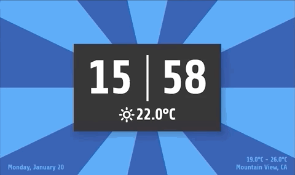
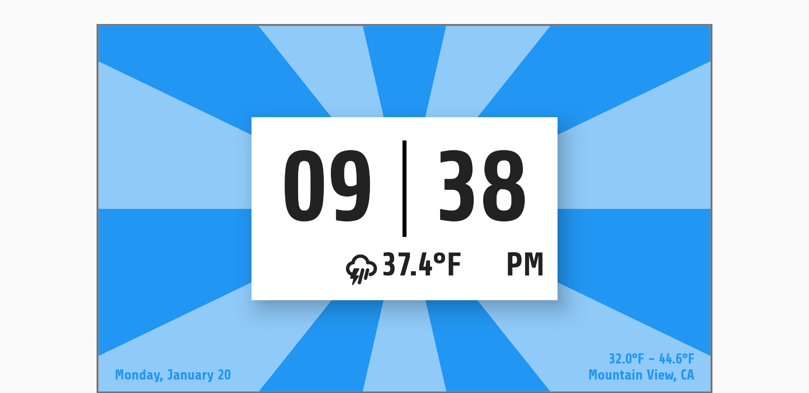
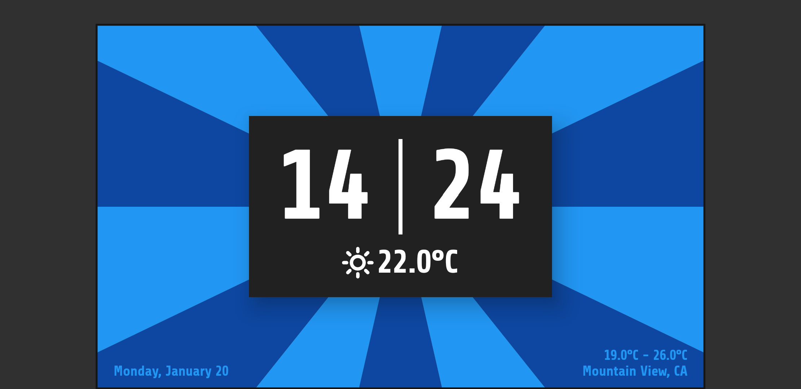
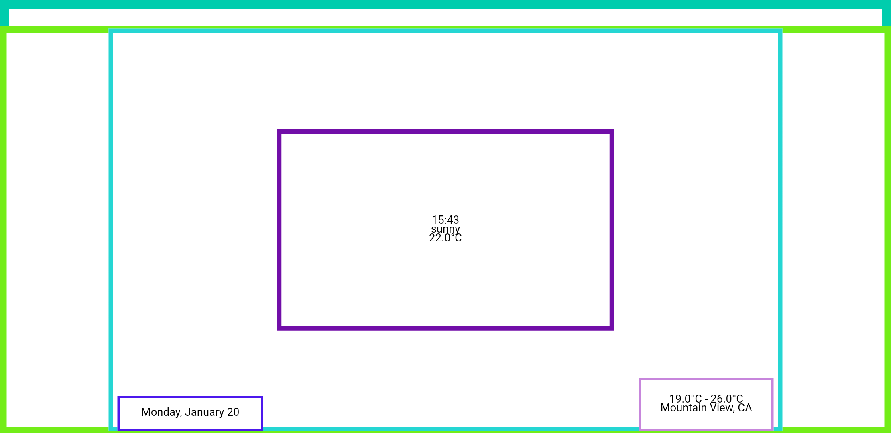

# Sunrise Clock

## Features
* 24 hour format (AM/PM)
* Dark/Light theme
* Icons for weather condition
* Temperature
* Every changed hour the sunrise animation will be triggered (see in the gif's below)
* Date, temperature range and location are clipped out of the animation with the current inverted colors
* Improved semantics for e.g. TalkBack
* Animation for time changes and temperature/condition changes

Not a feature but still: No external packages used ... : - ) 

(besides the WeatherFont)

## Gifs

### Light

### Dark

## Screenshots

### Light

### Dark

### Semantics

## Sunrise Clock  Licensing

* [Weather Icons](http://erikflowers.github.io/weather-icons/) licensed under [SIL OFL 1.1](https://scripts.sil.org/cms/scripts/page.php?site_id=nrsi&id=OFL)

* Sunrise code licensed under [MIT License](sunrise_clock/LICENSE) 

# Flutter Clock

Welcome to Flutter Clock!

See [flutter.dev/clock](https://flutter.dev/clock) for how to get started, submission requirements, contest rules, and FAQs.

See a [live demo](https://maryx.github.io/flutter_clock) with Flutter for Web!

Example [Analog Clock](analog_clock)

Example [Digital Clock](digital_clock)

